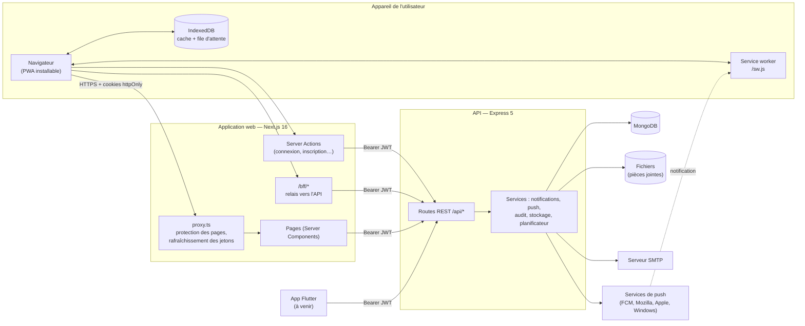
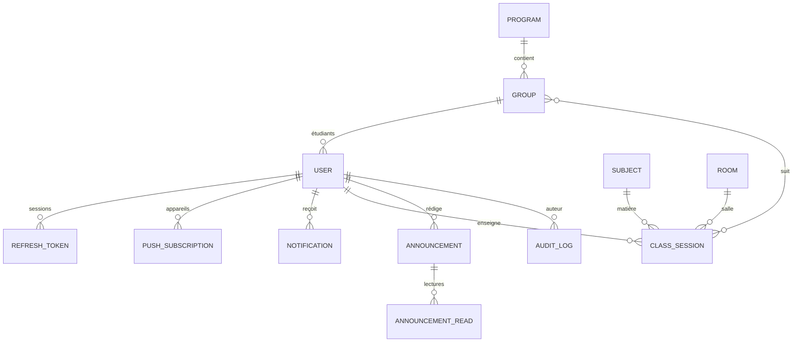

# CampusLink — Architecture technique

Ce document décrit l'architecture de CampusLink à la fin de la **phase 1** (modules 1, 7, 8 et la partie
« authentification et rôles » du module 10). Le contrat détaillé des API et des écrans est dans
[`phase1-contract.md`](phase1-contract.md) ; le guide d'installation est dans [`deploiement.md`](deploiement.md).

## 1. Vue d'ensemble



- **Le navigateur ne parle jamais directement à l'API.** Les jetons sont dans des cookies `httpOnly` posés par
  Next.js ; les pages serveur, les Server Actions et le relais `/bff/*` appellent l'API avec `Authorization: Bearer`.
- **L'API ne dépend d'aucun cookie** : elle renvoie les jetons dans le corps JSON et des codes d'erreur stables,
  pour que l'application Flutter prévue puisse l'utiliser telle quelle.
- **MongoDB** stocke toutes les données ; les pièces jointes sont sur disque (`STORAGE_DIR`) derrière un service
  de stockage remplaçable par un stockage objet de type S3.

## 2. Choix techniques

| Couche | Choix | Raison |
|---|---|---|
| Web / PWA | Next.js 16 (App Router), React 19, Tailwind CSS 4, next-intl | Rendu serveur, Server Actions, `proxy.ts` pour la sécurité des sessions, traduction FR/EN |
| Hors ligne | Service worker écrit à la main, IndexedDB (`idb`) | Contrôle précis de ce qui est gardé sur un ordinateur partagé |
| API | Node.js, Express 5, Mongoose 9 | Même langage que le web, erreurs asynchrones gérées par Express 5 |
| Base de données | MongoDB (index TTL, index uniques) | Expiration automatique des sessions et des notifications |
| Push | Web Push (VAPID, bibliothèque `web-push`) | Notifications natives sans store ; FCM prévu pour Flutter |
| Tests | Playwright (API + navigateur) | Un seul outil pour l'API et l'interface |

Le cahier des charges proposait React + Vite, NestJS et PostgreSQL à titre indicatif. Next.js couvre le rendu et
la PWA, Express reste léger pour un projet de cette taille, et le modèle de données (documents avec listes de
groupes, d'audiences, de pièces jointes) se prête bien à MongoDB.

## 3. Authentification et sessions

1. **Connexion** : `POST /api/auth/login` vérifie le mot de passe (bcrypt). Si la validation en deux étapes est
   activée, un code à 6 chiffres est envoyé par e-mail (`verify-otp`, 10 min, 5 essais).
2. **Jetons** : un **jeton d'accès** JWT (HS256, 15 min, rôle + identifiant de session) et un **jeton de
   rafraîchissement** opaque (30 jours), stocké haché en base et à usage unique (rotation à chaque
   rafraîchissement).
3. **Côté web** : les cookies `cl_access`, `cl_refresh` (session si « Rester connecté » n'est pas coché),
   `cl_remember` et `cl_owner` sont `httpOnly`/`SameSite=Lax`/`Secure` en production. `proxy.ts` rafraîchit
   les jetons expirés avant le rendu et redirige vers `/login` sans session.
4. **Déconnexion / changement de mot de passe** : les jetons de rafraîchissement sont révoqués, les
   abonnements push de la session supprimés, et le navigateur efface ses données hors ligne
   (`Clear-Site-Data`, IndexedDB, caches).

## 4. Rôles et permissions

| Rôle | Accès |
|---|---|
| `STUDENT` | Son emploi du temps (via son groupe), les annonces qui le ciblent, ses notifications, son compte |
| `TEACHER` | Son emploi du temps d'enseignant, annonces vers les groupes où il enseigne (année en cours) |
| `ADMIN` | Tout : utilisateurs, structure académique, emploi du temps, toutes les annonces, journal d'audit |
| `ALUMNI` | Annonces, compte (annuaire et mentorat : module 6, phase 3) |

Les rôles sont relus en base à chaque requête : un changement de rôle s'applique immédiatement. L'inscription
publique crée toujours un compte `STUDENT` ; le premier administrateur est créé par `npm run create-admin`.

## 5. Modèle de données



| Collection | Contenu principal |
|---|---|
| `users` | Nom, e-mail unique, mot de passe haché, rôle, langue (`fr`/`en`), groupe, 2FA |
| `refreshtokens` | Hash du jeton, session, expiration (index TTL) |
| `programs`, `groups`, `subjects`, `rooms` | Structure académique (filières, groupes par niveau et année, matières, salles) |
| `classsessions` | Séance : matière, enseignant, groupes, salle, début/fin, type, statut, série hebdomadaire, dernier changement |
| `announcements`, `announcementreads` | Annonce (priorité, audience, pièces jointes, statut, publication programmée) et lectures |
| `notifications` | Notifications in-app dans la langue du destinataire (gardées 90 jours) |
| `pushsubscriptions` | Abonnements Web Push (ou FCM) liés à une session |
| `auditlogs` | Actions sensibles : auteur, action, cible, IP, navigateur, date |

## 6. Modules de la phase 1

### Module 1 — Emploi du temps
- Saisie par l'administration (séance seule ou **série hebdomadaire**, jusqu'à 26 semaines) ou **import CSV**
  (vérification à blanc, tout ou rien).
- **Détection des conflits** de salle, d'enseignant et de groupe avant toute écriture.
- Emploi du temps **généré automatiquement** pour chaque étudiant (son groupe) et chaque enseignant ; vues jour,
  semaine et mois ; filtres par matière et par enseignant.
- **Changement de salle, d'horaire ou annulation** : notification in-app et push aux étudiants et enseignants
  concernés (séances à venir dans les 14 jours), et mise en évidence (« Déplacé depuis… », « Annulé »).
- **Export** : lien d'abonnement iCal personnel (Google Agenda, Outlook, Apple) et téléchargement `.ics`.

### Module 7 — Annonces et notifications
- Annonces avec **priorité** (urgente, importante, normale, faible), **pièces jointes** et **ciblage** par rôle,
  filière, niveau et groupe ; nombre de destinataires calculé en direct.
- Brouillon, publication immédiate ou **programmée** (planificateur en arrière-plan).
- Diffusion par **notification in-app + push**, par lots, sans bloquer la requête.
- **Statistiques** : destinataires, lectures, taux de lecture, lectures par jour.
- Les enseignants n'écrivent qu'aux groupes où ils enseignent cette année.

### Module 8 — Mode hors ligne (PWA)
- Manifeste, icônes, service worker : l'application est **installable** sur mobile et ordinateur.
- **Données** : chaque écran de données lit d'abord IndexedDB puis revalide sur le réseau
  (*stale-while-revalidate*), avec la date de dernière mise à jour.
- **Pages** : réseau d'abord, puis copie enregistrée, puis page `/offline`. Seules les pages des modules hors
  ligne sont gardées, chacune liée à son propriétaire et expirant après 24 h ; jamais les pages d'administration.
- **Actions hors ligne** (ex. annonce lue) : mises en file dans IndexedDB et rejouées au retour du réseau
  (Background Sync quand le navigateur le permet).
- Bandeau d'état « Tu es hors ligne » et nombre de modifications en attente.

### Module 10 (partie phase 1) — Authentification et rôles
Rôles et permissions par module, validation en deux étapes par e-mail, journal d'audit des actions sensibles,
mot de passe oublié / changement de mot de passe. Le SSO de l'établissement et OAuth Google restent à faire.

## 7. Sécurité

- Mots de passe hachés (bcrypt), jetons de réinitialisation et codes OTP stockés hachés, comparaisons à temps
  constant, même réponse pour un e-mail inconnu et un mauvais mot de passe.
- Limitation du nombre de tentatives (connexion, inscription, code OTP, mot de passe oublié, changement de mot de
  passe), par IP et par e-mail.
- Validation stricte des entrées (types, injection d'opérateurs MongoDB), des fichiers envoyés (type réel,
  taille, nombre, noms de fichiers) et des points de terminaison push (services de push connus uniquement).
- Relais `/bff` : même origine exigée pour les requêtes qui modifient des données, routes d'authentification
  bloquées, taille des requêtes limitée.
- En-têtes de sécurité (CSP, HSTS en production, X-Frame-Options, Referrer-Policy, nosniff), redirections
  `?next=` limitées à des chemins internes.
- Journal d'audit des actions sensibles ; données hors ligne effacées à la fin d'une session sur un ordinateur
  partagé.
- Vérifié par `tests/api/security.spec.ts` (autorisations par rôle, accès aux données d'autrui, affectation de
  champs interdits, fichiers, injection, fuites de secrets, limitation, protections du relais web).

## 8. Langues

Interface en **français (par défaut, tutoiement)** et en **anglais**. La langue vient du cookie `NEXT_LOCALE`,
sinon du navigateur ; elle est enregistrée sur le compte (`locale`) et utilisée pour les e-mails, les
notifications et les push. Les textes sont dans `next/messages/<langue>/<module>.json`.

## 9. Organisation du code

```
backend/            API Express
  app.js            démarrage, middlewares, routes
  models/           schémas Mongoose
  controllers/      logique des routes
  routes/           auth, users, academic, notifications, push, audit, timetable, announcements
  service/          jetons, e-mails, notifications, push, audit, audience, stockage, planificateur, modules
  middleware/       authentification, rôles, limitation, envoi de fichiers, journalisation, erreurs
  scripts/          create-admin, generate-vapid, seed-demo (+ seed/*.js)
next/               application web
  app/              pages ((front), (auth), (back)/dashboard), /bff, /offline, /auth/expired
  components/       interface (ui, shell, pwa, timetable, announcements…)
  lib/              client API serveur, sessions, données hors ligne, formats de date
  messages/         traductions fr / en
  public/sw.js      service worker
  proxy.ts          protection des routes et rafraîchissement des jetons
tests/              Playwright : projets "api" et "e2e" (dont security.spec.ts)
docs/               contrat, architecture, déploiement, spécifications, démos
```

## 10. Limites connues et suites

- Pas de SSO établissement ni OAuth Google (module 10).
- Envoi push vers FCM (application Flutter) non implémenté : les abonnements FCM sont déjà acceptés et stockés.
- MongoDB sans *replica set* en local : la vérification des conflits d'emploi du temps n'est pas
  transactionnelle (deux administrateurs au même instant).
- Modules suivants : 5 (réservation de salles), 4 (forum), 9 (tableau de bord étudiant), puis 2, 3 et 6.
