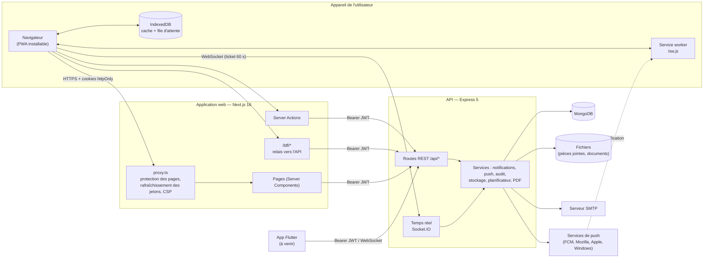

# CampusLink — Architecture technique

Ce document décrit l'architecture de CampusLink après les **phases 1 à 3** : modules 1 (emploi du temps),
2 (covoiturage), 3 (marketplace de notes), 4 (forum), 5 (réservations), 6 (réseau alumni), 7 (annonces),
8 (hors ligne), 9 (suivi étudiant) et la partie « authentification et rôles » du module 10. Les contrats
détaillés des API et des écrans sont dans [`phase1-contract.md`](phase1-contract.md),
[`phase2-contract.md`](phase2-contract.md) et [`phase3-contract.md`](phase3-contract.md) ; l'installation est
décrite dans [`deploiement.md`](deploiement.md).

## 1. Vue d'ensemble



- **Le navigateur ne parle pas directement à l'API REST.** Les jetons sont dans des cookies `httpOnly` posés par
  Next.js ; les pages serveur, les Server Actions et le relais `/bff/*` appellent l'API avec `Authorization: Bearer`.
  Seule exception : la connexion **temps réel** (chat du covoiturage, notifications en direct), ouverte directement
  vers l'API avec un **ticket** de 60 secondes obtenu par `/bff/realtime/ticket`.
- **L'API ne dépend d'aucun cookie** : jetons dans le corps JSON, codes d'erreur stables, connexion temps réel
  possible avec le jeton d'accès — l'application Flutter prévue pourra l'utiliser telle quelle.
- **MongoDB** stocke les données ; les fichiers (pièces jointes, documents de la marketplace) sont sur disque
  (`STORAGE_DIR`) derrière un service de stockage remplaçable par un stockage objet de type S3.

## 2. Choix techniques

| Couche | Choix | Raison |
|---|---|---|
| Web / PWA | Next.js 16 (App Router), React 19, Tailwind CSS 4, next-intl | Rendu serveur, Server Actions, `proxy.ts` pour la sécurité des sessions, traduction FR/EN |
| Hors ligne | Service worker écrit à la main, IndexedDB (`idb`) | Contrôle précis de ce qui est gardé sur un ordinateur partagé |
| API | Node.js, Express 5, Mongoose 9 | Même langage que le web, erreurs asynchrones gérées par Express 5 |
| Base de données | MongoDB (index TTL, uniques, texte, `2dsphere`) | Expiration automatique, recherche plein texte, recherche géographique |
| Temps réel | Socket.IO (WebSocket) | Chat du covoiturage, notifications en direct ; client Dart disponible pour Flutter |
| Push | Web Push (VAPID, `web-push`) | Notifications natives sans store ; FCM prévu pour Flutter |
| Graphiques / PDF | Recharts, pdfkit | Tableau de bord étudiant, bilan PDF généré côté serveur |
| Tests | Playwright (API + navigateur) | Un seul outil pour l'API, la sécurité et l'interface |

Le cahier des charges proposait React + Vite, NestJS, PostgreSQL et un moteur de recherche dédié à titre
indicatif. Next.js couvre le rendu et la PWA, Express reste léger pour un projet de cette taille, et MongoDB couvre
le modèle documentaire, la recherche plein texte (forum, marketplace) et la géolocalisation (covoiturage) sans
service supplémentaire.

## 3. Authentification et sessions

1. **Connexion** : mot de passe vérifié (bcrypt) ; si la validation en deux étapes est activée, un code à
   6 chiffres est envoyé par e-mail (10 min, 5 essais).
2. **Jetons** : un **jeton d'accès** JWT (HS256, 15 min, rôle + identifiant de session) et un **jeton de
   rafraîchissement** opaque (30 jours), stocké haché et à usage unique. La session garde un identifiant stable,
   auquel sont rattachés les abonnements push.
3. **Côté web** : cookies `httpOnly`/`SameSite=Lax`/`Secure` en production ; `proxy.ts` rafraîchit les jetons
   expirés avant le rendu et redirige vers `/login` sans session.
4. **Fin de session** : jetons révoqués, abonnements push de la session supprimés, données hors ligne effacées du
   navigateur (`Clear-Site-Data`, IndexedDB, caches).

## 4. Rôles et permissions

| Rôle | Accès |
|---|---|
| `STUDENT` | Emploi du temps de son groupe, annonces, notifications, réservations (3 à venir, 3 h max), forum, suivi personnel (présences, notes, PDF), covoiturage, marketplace, demandes de mentorat |
| `TEACHER` | Son emploi du temps, annonces vers ses groupes, appel et notes de ses groupes, réservations (8 h max), forum (réponses certifiées), marketplace, réseau alumni |
| `ADMIN` | Tout : utilisateurs, structure académique, emploi du temps, annonces, validation des réservations, matériel, modération (forum, marketplace, alumni), suivi des étudiants, journal d'audit |
| `ALUMNI` | Annonces, forum, profil alumni (avec consentement), mentorat, fil d'actualités alumni |

Les rôles sont relus en base à chaque requête : un changement s'applique immédiatement. L'inscription publique
crée toujours un compte `STUDENT` ; le premier administrateur est créé par `npm run create-admin`.

## 5. Modèle de données (principales collections)

| Domaine | Collections |
|---|---|
| Comptes | `users` (rôle, langue, groupe, 2FA), `refreshtokens` (sessions, TTL), `pushsubscriptions`, `auditlogs` |
| Structure | `programs`, `groups`, `subjects`, `rooms` |
| Module 1 | `classsessions` (séries hebdomadaires, dernier changement) |
| Module 7 | `announcements`, `announcementreads`, `notifications` (TTL 90 jours) |
| Module 5 | `equipment`, `bookings`, `bookingslots` (créneaux de 15 min à index unique) |
| Module 4 | `forumquestions` (index texte), `forumanswers`, `forumvotes`, `forumprofiles`, suivis, vues, signalements |
| Module 9 | `attendancerecords`, `attendancealerts`, `assessments`, `grades` |
| Module 2 | `trips` (index `2dsphere`), `triprequests`, `tripmessages`, `tripratings` |
| Module 3 | `marketdocuments` (index texte), `marketpurchases`, `marketreviews`, `marketreports`, `wallets`, `wallettransactions` |
| Module 6 | `alumniprofiles`, `mentoringrequests`, `alumniposts` |

Les modules se référencent par nom de modèle (`mongoose.models.<Nom>`), ce qui permet par exemple de refuser la
suppression d'une salle encore réservée ou d'une matière utilisée par le forum ou les évaluations (409 `IN_USE`).

## 6. Modules

| Module | Points clés |
|---|---|
| 1 — Emploi du temps | Saisie admin (séries hebdomadaires) ou import CSV, conflits salle/enseignant/groupe, vues jour/semaine/mois, changements notifiés (in-app + push), export iCal / Google Agenda, consultable hors ligne |
| 2 — Covoiturage | Trajets vers ou depuis le campus, recherche géographique (rayon, date), coût partagé suggéré, demandes de place sans surréservation, **chat en temps réel** entre participants, notes après le trajet, coordonnées précises réservées aux participants |
| 3 — Marketplace | Dépôt de documents (PDF, images, Office) avec matière, niveau, professeur, année ; validation par l'administration, signalements ; **jetons fictifs** (portefeuille, achats atomiques, jamais de débit double ni de solde négatif) ; avis ; recherche et filtres |
| 4 — Forum | Questions par matière, recherche plein texte et questions similaires, votes, réponse acceptée, réponses certifiées des enseignants, réputation et badges, suivi, réponses hors ligne, modération |
| 5 — Réservations | Salles et matériel, disponibilités en temps réel, salles libres, conflits bloqués (y compris avec les cours), validation optionnelle, verrouillage optimiste, rappels, statistiques d'occupation |
| 6 — Réseau alumni | Profils avec **consentement explicite** (RGPD), annuaire filtrable, demandes de mentorat (contact partagé seulement après acceptation), fil d'actualités, export et effacement des données |
| 7 — Annonces | Priorité, pièces jointes, ciblage rôle/filière/niveau/groupe, publication programmée, in-app + push, statistiques de lecture |
| 8 — Hors ligne | PWA installable, coquille et pages des modules hors ligne mises en cache (liées au propriétaire, 24 h), données dans IndexedDB, file d'actions rejouée au retour du réseau, bandeau d'état |
| 9 — Suivi étudiant | Appel par l'enseignant, taux d'absence et alertes, évaluations et notes publiées, moyennes pondérées, graphiques, comparaison anonymisée (≥ 5 étudiants), bilan PDF |
| 10 — Authentification (partie) | Rôles et permissions par module, validation en deux étapes, journal d'audit ; SSO et Google à venir |

Spécifications fonctionnelles détaillées : [`specifications/`](specifications/).

## 7. Sécurité

- Mots de passe hachés (bcrypt) ; jetons de réinitialisation, codes OTP et jetons de session stockés hachés ;
  jeton du flux iCal dérivé par HMAC ; comparaisons à temps constant ; même réponse pour un e-mail inconnu et un
  mauvais mot de passe.
- Limitation des tentatives (connexion, inscription, code OTP, mots de passe) et des écritures par utilisateur
  (réservations, forum, chat, dépôts, PDF).
- Validation stricte des entrées (types, injection d'opérateurs MongoDB), des fichiers (type réel, taille,
  nombre, noms) et des points de terminaison push (services connus uniquement).
- **Concurrence sans transactions** : créneaux de réservation et places de covoiturage réservés par écritures
  atomiques ou index uniques ; portefeuille débité par mise à jour conditionnelle ; décisions protégées par
  verrouillage optimiste.
- **Vie privée** : identités masquées dans les disponibilités, coordonnées de départ arrondies pour les
  non-participants, profils alumni invisibles sans consentement, e-mails partagés seulement après un mentorat
  accepté, comparaison de notes seulement à partir de 5 étudiants, données hors ligne liées à leur propriétaire.
- Temps réel : ticket signé de 60 s (ou jeton d'accès), salles accessibles seulement aux participants.
- Relais `/bff` : même origine exigée pour les écritures, routes d'authentification bloquées, taille limitée.
- En-têtes de sécurité : CSP avec nonce, HSTS en production, X-Frame-Options, Referrer-Policy, nosniff ;
  redirections `?next=` limitées à des chemins internes.
- Journal d'audit des actions sensibles.
- Vérifié par `tests/api/security.spec.ts` (autorisations par rôle, accès aux données d'autrui, affectation de
  champs interdits, concurrence, fichiers, injection, fuites, limitation, temps réel).

## 8. Langues

Interface en **français (par défaut, tutoiement)** et en **anglais**. La langue vient du cookie `NEXT_LOCALE`,
sinon du navigateur ; elle est enregistrée sur le compte (`locale`) et utilisée pour les e-mails, les
notifications, les push et le bilan PDF. Les textes sont dans `next/messages/<langue>/<module>.json`.

## 9. Organisation du code

```
backend/            API Express
  app.js            démarrage, middlewares, routes, temps réel
  models/ controllers/ routes/ service/ middleware/
  scripts/          create-admin, generate-vapid, seed-demo (+ seed/10…80 par module)
  docs/             documentation de chaque module de la phase 2 et 3
next/               application web
  app/              pages ((front), (auth), (back)/dashboard/…), /bff, /offline, /auth/expired
  components/ lib/  interface et logique par module (timetable, announcements, bookings, forum, analytics,
                    carpool, marketplace, alumni, realtime, offline…)
  messages/         traductions fr / en par module
  public/sw.js      service worker
  docs/             documentation de chaque module de la phase 2 et 3
tests/              Playwright : projets "api" et "e2e" (dont security.spec.ts)
docs/               contrats, architecture, déploiement, spécifications, qualité, démos
```

## 10. Limites connues et suites

- Pas de SSO établissement ni de connexion Google (module 10).
- Envoi push vers FCM (application Flutter) non implémenté : les abonnements FCM sont acceptés et stockés.
- Temps réel sur une seule instance (pas d'adaptateur Redis) ; limiteurs de débit en mémoire par instance.
- MongoDB sans *replica set* en local : pas de transactions ; la cohérence repose sur des écritures atomiques et
  des index uniques (documenté par module).
- Mode hors ligne complet seulement pour l'emploi du temps, les annonces, les notifications et la lecture du
  forum, des réservations et du suivi ; les autres modules demandent le réseau.
- Modules complémentaires 11 à 18 (phase suivante du cahier des charges).
